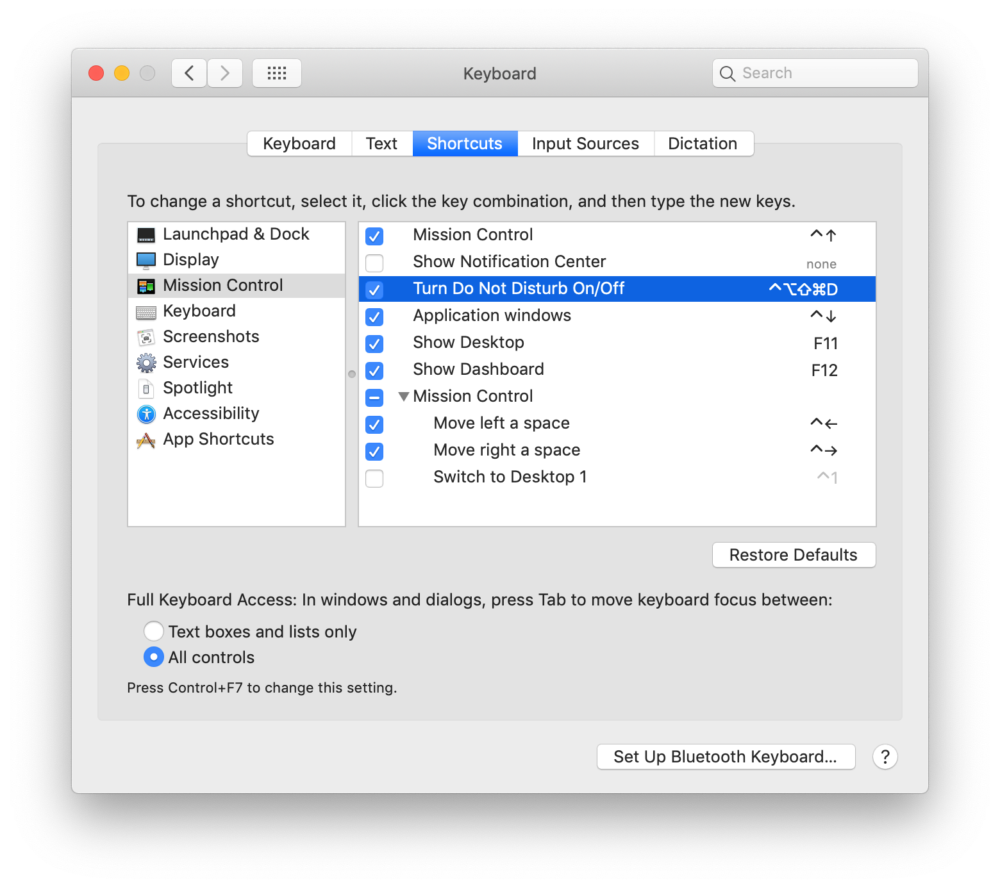

# Smart “Do Not Disturb” on macOS

## Step 1: Create a Keyboard Shortcut

The first step towards a smart DND on the Mac is to assign a keyboard shortcut for toggling DND on or off.

I recommend `⌘⇧⌃⌥D` (especially if you have `⌘⇧⌃⌥` setup as a 	[Hyper Key](https://brettterpstra.com/2017/06/15/a-hyper-key-with-karabiner-elements-full-instructions/).)

You can set up your keyboard shortcut in System Preferences here:

